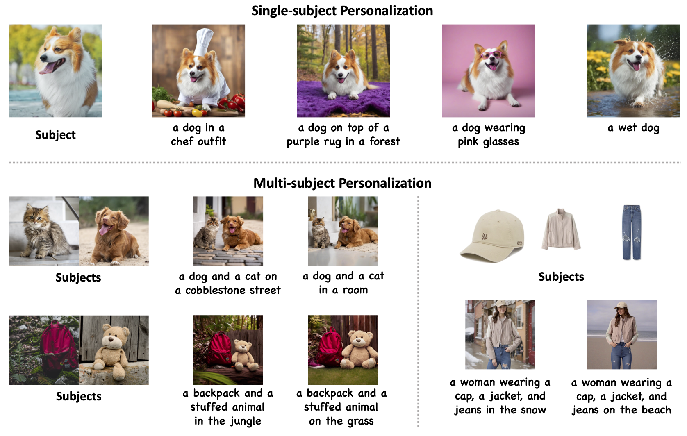
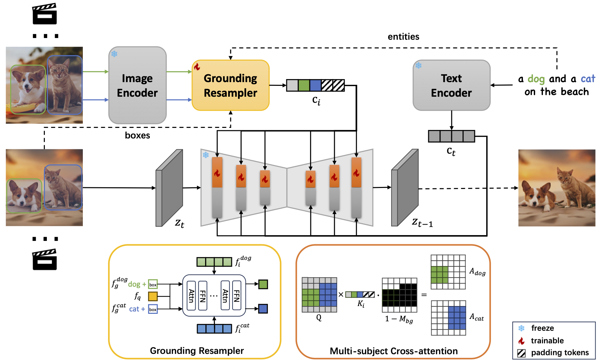

## <div align="center"> <i>MS-Diffusion</i>: Multi-subject Zero-shot Image Personalization with Layout Guidance </div>

<div align="center">

  <a href="https://MS-Diffusion.github.io"></a> &ensp;
  <a href="https://arxiv.org/abs/2406.07209"></a> &ensp;
  <a href="https://huggingface.co/doge1516/MS-Diffusion"></a> &ensp;

</div>

---

## News

:sunglasses: [2025.02.07] **MS-Diffusion is accepted by ICLR 2025!** We are working on updating the paper and training code...

:mag_right: [2025.02.07] Our follow-up work MIP-Adapter is available at https://github.com/hqhQAQ/MIP-Adapter.

## Overview



This repository contains the official implementation of the paper "MS-Diffusion: Multi-subject Zero-shot Image Personalization with Layout Guidance".

Recent advancements in text-to-image generation models have dramatically enhanced the generation of photorealistic images from textual prompts, leading to an increased interest in personalized text-to-image applications, particularly in multi-subject scenarios. However, these advances are hindered by two main challenges: firstly, the need to accurately maintain the details of each referenced subject in accordance with the textual descriptions; and secondly, the difficulty in achieving a cohesive representation of multiple subjects in a single image without introducing inconsistencies. To address these concerns, our research introduces the MS-Diffusion framework for layout-guided zero-shot image personalization with multi-subjects. This innovative approach integrates grounding tokens with the feature resampler to maintain detail fidelity among subjects. With the layout guidance, MS-Diffusion further improves the cross-attention to adapt to the multi-subject inputs, ensuring that each subject condition acts on specific areas. The proposed multi-subject cross-attention orchestrates harmonious inter-subject compositions while preserving the control of texts. Comprehensive quantitative and qualitative experiments affirm that this method surpasses existing models in both image and text fidelity, promoting the development of personalized text-to-image generation.

MS-Diffusion introduces two pivotal enhancements to the model: the grounding resampler and multi-subject cross-attention mechanisms. Firstly, the grounding resampler adeptly assimilates visual information, correlating it with specific entities and spatial constraints. Subsequently, the cross-attention mechanism facilitates precise interactions between the image condition and the diffusion latent within the multi-subject attention layers. Throughout the training phase, all components of the pre-existing diffusion model remain frozen.



## Community Resources

Thanks to [smthemex](https://github.com/smthemex) for providing a [ComfyUI Version](https://github.com/smthemex/ComfyUI_MS_Diffusion).

## Getting Started

### Setup

```bash
git clone git@github.com:MS-Diffusion/MS-Diffusion.git
cd msdiffusion
pip install -r requirements.txt
```

### Model

Download the pretrained base models from [SDXL-base-1.0](https://huggingface.co/stabilityai/stable-diffusion-xl-base-1.0) and [CLIP-G](https://huggingface.co/laion/CLIP-ViT-bigG-14-laion2B-39B-b160k).

Download our checkpoint from [MS-Diffusion](https://huggingface.co/doge1516/MS-Diffusion).

### Inference

```bash
python inference.py
```

You should add the pretrained model and referenced subject paths in the script. In practice, masked images would be better since they contain no irrelevant information. Modify `phrases` and `boxes` to fit your needs. Note that the `phrases` and `boxes` should be in the same order with input images.

The `scale` parameter is used to determine the extent of image control. For default, the `scale` is set to 0.6. In practice, the `scale` of 0.4 would be better if your input contains subjects needing to effect on the whole image, such as the background. **Feel free to adjust the `scale` in your applications.**

If you want to inference with controlnets, please set up your controlnet models and run:

```bash
python inference_controlnet.py
```

## Benchmark

We provide the proposed MS-Bench in `./msbench`. The prompt template is in `./msdiffusion/dataset/prompts/msbench.py`.

MS-Bench contains four data types and 13 combination types with two or three subjects. Each combination type other than those related to the scene has 6 prompt variations. There are 1148 combinations and 4488 evaluation samples, where entities and boxes are subject categories and preset layouts. Compared to other multi-subject benchmarks, our MS-Bench ensures that the model performance can be reflected comprehensively in abundant cases.

Details can be found in the paper.

## Todo List

- [x] paper
- [x] inference code
- [x] model weights
- [ ] training code

## New Features

### Auto Layout Guidance

You may find the layout prior is hard to determine in some cases. MS-Diffusion now supports using the text cross-attention maps as the psuedo layout guidance. Specifically, since the text cross-attention maps can reflect the area of each text token, we can replace the layout prior with them during the inference. You can enable this feature easily by:

```python
images = ms_model.generate(..., mask_threshold=0.5, start_step=5)
```

Here, `mask_threshold` is used to filter the text cross-attention maps, and `start_step` is the step to start using the psuedo layout guidance. In this way, you can provide a rough box input. MS-Diffusion still uses the layout prior before the `start_step` and then switches to the areas where the activation value in the text cross-attention maps is larger than the `mask_threshold`. Note that you have to ensure the `phrases` can be found in the text when you use this feature. The generation quality depends on the accuracy of the text cross-attention maps.

This feature is found to be useful when the subject boxes are overlapping, such as "object+scene". With the auto layout guidance, you could also increase the `scale` for higher image fidelity.

You can also completely disable the layout prior by setting `boxes` to zeros and `drop_grounding_tokens` to 1. However, we have found a degradation in the generation quality when using this setting. We recommend using the layout prior at early steps.

### Multi-Subject Scales

Now MS-Diffusion supports different scales for different subjects during the inference. You can set the `subject_scales` when calling the `generate()` function:

```python
subject_scales = [0.6, 0.8]
images = ms_model.generate(..., subject_scales=subject_scales)
```

When using `subject_scales`, `scale` will have no effect on the model.

## Acknowledgement

This repository is built based on the fancy, robust, and extensible work of [IP-Adapter](https://github.com/tencent-ailab/IP-Adapter). We also thank StabilityAI and HuggingFace for their contribution to the open source community.

## Citation

If you find this work helpful, please consider citing:

```bibtex
@article{wang2024ms,
  title={MS-Diffusion: Multi-subject Zero-shot Image Personalization with Layout Guidance},
  author={Wang, X and Fu, Siming and Huang, Qihan and He, Wanggui and Jiang, Hao},
  journal={arXiv preprint arXiv:2406.07209},
  year={2024}
}
```
